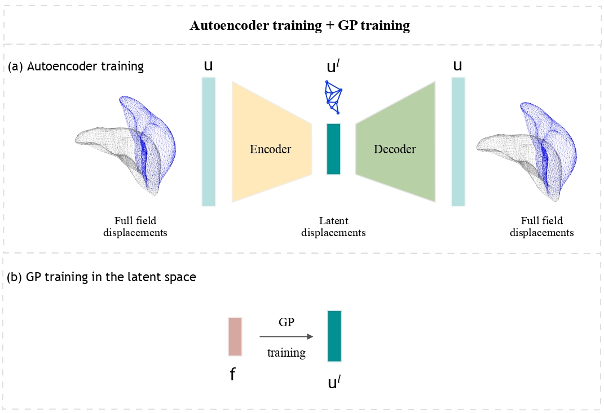
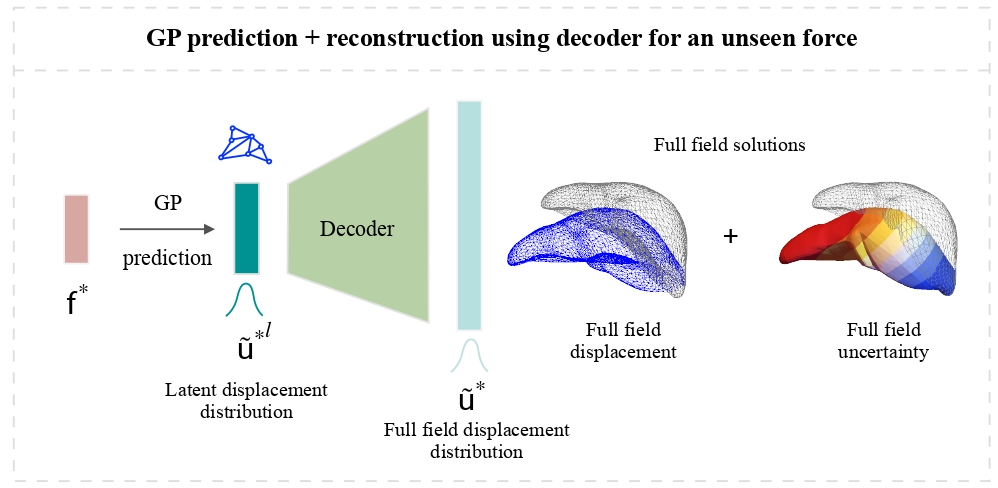

## Gaussian Process Regression + Deep Neural Network Autoencoder for Probabilistic Surrogate Modeling in Nonlinear Mechanics of Solids  

This work introduces an approach that combines autoencoder networks with the probabilistic regression capabilities of Gaussian processes. The autoencoder provides a low-dimensional representation of the solution space, while the Gaussian Processes (GPs) provides a probabilistic mapping between the low-dimensional inputs and outputs. We show the applications of the proposed approach in predicting non-linear deformation of solids along with associated uncertainties.
<br />

### Framework Overview

The framework is used to predict full field displacement of solid bodies subjected along with uncertainties, provided forces applied on it.

The proposed framework has two stages
1. **Training**: <br />
- Autoencoder Network Training: Train the autoencoder network on full field displacement data and use the encoder part to obtain latent representations of the full field displacements.
- Gaussian Processes Training: Use the latent representations obtained using the autoencoder network to train independent GPs. The input features for the GPs are body force density vectors, each with a dimension of 3.



<br />

2. **Prediction**: <br />
- Latent Displacement Prediction: Once both models are trained, for a given input force, predict distributions for latent displacements using the GPs.
- Full Field Projection: Project the latent displacements to the full field using the decoder part of the autoencoder network.


<br />
<br />


## Usage Instructions

- ### Prediction using pretrained models <br />
By default optimised autoencoder weights and trained GP models are provided to `predict.py` script. To utilize different pretrained weights or specify a particular test case, provide the model weights and define the test number you wish to predict using the following command::

```bash
python predict.py --wts_path path/to/weights --test_no test_no_to_predict
```

It is important to note that the GP models should be trained on the latent representations corresponding to the new
autoencoder models whose path is provided in the above step. This is because different autoencoder
models can have different latent representations for the same full field space data. Ensuring that the GP models are trained on the appropriate latent representations is crucial for accurate predictions.

Default trained **autoencoder model weights and GP models will be provided** in the ['src/pretrained_models'](src/pretrained_models) directory. The autoencoder weight file is `best_auto.h5`, and the optimized GP models for all latent units are stored as `GP_{latent_unit_no}.pkl` in the ['src/pretrained_models/best_GPs'](src/pretrained_models/best_GPs) directory.

- ### Postprocessing of results <br />

The output file generated by running `predict.py` can be visualized using the AceFEM library with the `visualisation.nb`
Mathematica notebook provided in the ['src/results'](src/results) directory. Running this notebook
will generate multiple plots to visualise the prediction of the GP + Autoencoder framework. They are stored
in the directory corresponding to the respective test example.


- ### Training from scratch <br />

Training is performed in two step
1. Training of autoencoder: Optimised weights and corresponding compressed (or) latent representations are saved after the training:

```bash
python train.py --model autoencoder
```
2. Training of GPs: Train on the input forces (originally provided) and latent displacement data (latents obtained in the first step):
```bash
python train.py --model gp
```

Instead of running above scripts manually one can directly submit jobs using the `train.sh` (SLURM launcher script) provided in the [<span style="color:blue">'src/bash'</span>](src/bash) directory

```bash
sbatch train.sh
```
The above step submit jobs for training both autoencoder and GPs in the respective order.

Once the training is finished, optimised models are used to make predictions on new cases by providing the path of autoencoder weights file (identified with a unique timestamp generated while training) to `predict.py`.


**Note**: All essential parameters are located in the `config.py` file and can be modified as needed.

## Dependencies

The scripts have been tested running under Python 3.10 with the following packages installed (along with their dependencies).

- `tensorflow==2.12`
- `keras==2.12`
- `scikit-learn==1.2.2`

You can install dependencies using the 'requirement.txt' (tested for CPU), or 'gpauto.yml' (tested for GPU on Linux-based systems) files provided as follows:

1. Clone the repository:

```bash
git clone https://github.com/gp-auto-regression.git
cd gp-auto-regression
```
2. Set up the virtual environment and install dependencies:

For CPU system, create a virutal environment with pip or conda and install dependencies using 'requirement.txt' file as follows:
```bash
conda create -n gpauto python==3.10
conda activate gpauto
pip install -r requirements.txt
```
For GPU (Tested on Linux system)

```bash
conda env create -f gpauto.yml
conda activate gpauto
```

3. AceFEM installation for datageneration and postprocessing

Non-linear finite element simulations to generate the synthetic data are performed using the [AceFEM](http://symech.fgg.uni-lj.si/Download.htm)
library. AceFEM, which is based on Mathematica, requires Mathematica to be installed beforehand. Detailed installation instructions for
AceFEM are available [here](http://symech.fgg.uni-lj.si/Download.htm).
<br />

## Datasets

** NOTE: Datasets will be provided soon.**

Training data will be provided in the [<span style="color:blue">'src/data/training_data'</span>](src/bash) directory. Datsets have been obtained through non-linear FEM simulations using [AceFEM](http://symech.fgg.uni-lj.si/Download.htm) framework. The pipeline to create numpy arrays of datasets will be provided soon. <br />

Originally following four dataset arrays are provided.:

| Data                       | Shape                    | Description                                           |
|----------------------------|--------------------------|-------------------------------------------------------|
| `Y_train.npy`              | `(n_train, dof)`         | Full field displacements of training set (originally provided) |
| `Y_test.npy`               | `(n_test, dof)`          | Full field displacements of test set (originally provided)    |
| `latent_inputs_train.npy`  | `(n_train, 3)`           | Latent input forces of training set (originally provided)      |
| `latent_inputs_test.npy`   | `(n_test, 3)`            | Latent input forces of test set (originally provided)         |

<br />
Compressed (encoded) representations of `Y_train.npy` and `Y_test.npy` obtained using the encoder part of the optimised autoencoder network (with best weights) are saved in the [<span style="color:blue">'src/data/training_data'</span>](src/bash) directory as:

| Compressed Data                       | Shape                    | Description                                           |
|----------------------------|--------------------------|-------------------------------------------------------|
| `best_auto_latent_outputs_train.npy`| `(n_train, latent_dim)`   | Latent displacements of train set (obtained after encoding Y_train)     |
| `best_auto_latent_outputs_test.npy` | `(n_test, latent_dim)`    | Latent displacements of test set (obtained after encoding Y_test)       |

<br />

For training from scratch: Compressed displacement are saved as `{timestamp}_latent_outputs_train(test).npy` where 'timestamp' refers to the unique timestamp generated at the start of the training procedure.

<br />

## Reference


```
@misc{deshpande2024gaussianprocessregression,
      title={Gaussian process regression + deep neural network autoencoder for probabilistic surrogate modeling in nonlinear mechanics of solids},
      author={Saurabh Deshpande and Hussein Rappel and Mark Hobbs and Stéphane P. A. Bordas and Jakub Lengiewicz},
      year={2024},
      eprint={2407.10732},
      archivePrefix={arXiv},
      primaryClass={cs.CE},
      url={https://arxiv.org/abs/2407.10732},
}
```

<br />
